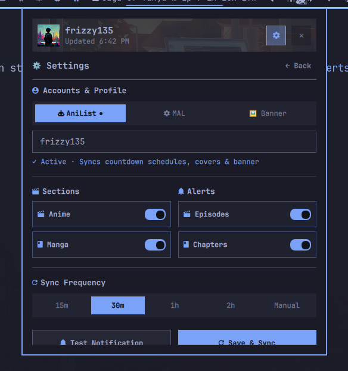
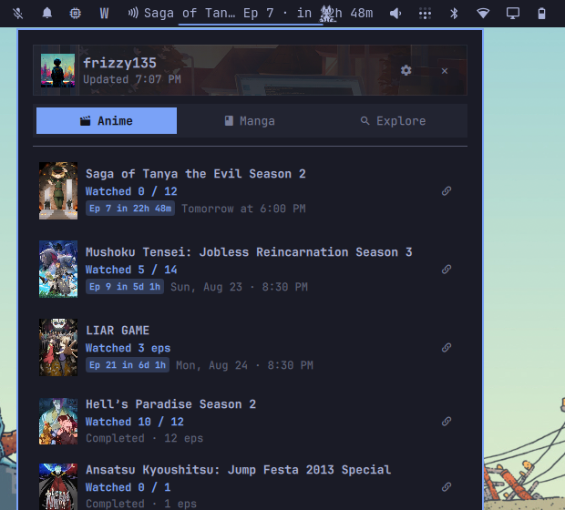
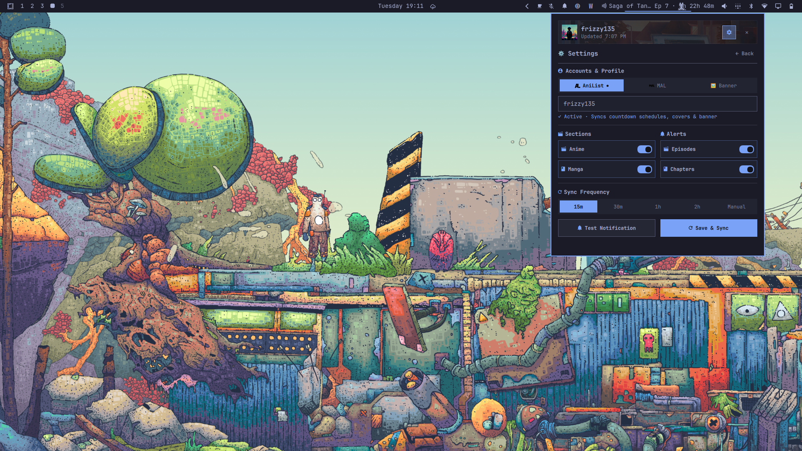

# AniSync for Omarchy

A native [Omarchy](https://omarchy.org/) status bar and popup plugin that synchronizes with **AniList**, **MyAnimeList (MAL)**, or **Simkl** to track anime episode releases, manga chapter countdowns, and watchlist progress with native desktop notifications.



## Features

- **Three Providers:** Connect a public AniList or MyAnimeList account by username — no passwords or OAuth tokens. Or link **Simkl** via the device PIN flow: a short code, no password entry in the plugin.
- **Live Release Schedules on MAL and Simkl too:** MAL watchlists are enriched with exact airing times via AniList's public API (exact ID matching, no fuzzy title search), and Simkl watchlists are joined against Simkl's public airing calendar — so countdowns and alerts work identically across all three providers.
- **Top Bar Countdown Ticker:** Live pill on your status bar showing your next upcoming episode (e.g. `One Piece Ep 1175 · in 2h`).
- **Batched Desktop Notifications:** Native alerts via `omarchy-notification-send` when new releases air. Multiple missed episodes are grouped per show (`4 New Episodes: One Piece (Ep 1170–1173)`) — one notification per show, never spam.
- **Instant Startup & Offline Resilience:** A local cache snapshot renders your lists immediately on shell start — even fully offline — while a background sync refreshes in the background. Failed syncs never blank the UI.
- **Dynamic Theming & Ambient Artwork:** Automatically harmonizes with your active Omarchy theme (`colors.toml`), with smart fallback to your currently watching show's cover art or custom banner image.
- **Multi-Tab Popup Panel:**
  - **Anime:** Live upcoming episode timeline with exact countdowns and active watchlist.
  - **Manga:** Reading list progress tracking with chapter counts and scores.
  - **Explore:** Search across AniList for any anime or manga with direct links and copyable URLs.
  - **Settings:** Provider switch, username, section toggles, release alerts, background check frequencies, and custom banner backdrop (drafted freely, applied on Save & Sync).
- **IPC & CLI Integration:** Trigger sync, open, close, or toggle the popup via `omarchy-shell akshad135.anisync <action>`.

---

## Installation

Install and enable the plugin:

```bash
omarchy plugin add https://github.com/Akshad135/anisync.git --enable
omarchy restart shell
```

---

## Usage & Controls

- **Left-Click Top Bar Button:** Toggle popup drawer.
- **Right-Click Top Bar Button:** Force immediate background re-sync.
- **Search Keybinding / CLI:** Toggle via `omarchy-shell akshad135.anisync toggle`.
- **Keyboard Shortcuts in Drawer:**
  - `Escape`: Close popup drawer.
  - `Enter` (in Search): Execute search.

---

## Configuration

Settings can be customized directly in the plugin drawer via the settings gear icon:
- **Provider:** `anilist`, `mal`, or `simkl` — one active account at a time.
- **Username (AniList / MAL):** Your public AniList or MyAnimeList username (matching the provider).
- **Simkl:** Click **Connect Simkl Account** — a browser window opens at [simkl.com/pin](https://simkl.com/pin/); enter the short code shown in the plugin. The access token is long-lived (~5 years) and stored locally; revoke anytime from Simkl's Connected Apps settings and reconnect. Manga tracking is unavailable on Simkl (the Manga tab hides automatically).
- **Sections:** Toggle Anime and Manga view tabs.
- **Alerts:** Enable or disable desktop notifications for new releases.
- **Sync Frequency:** Set periodic refresh interval (`15m`, `30m`, `1h`, `2h`, or `Manual`).
- **Custom Banner:** Specify a custom background banner URL or local image path.

All preferences persist in `~/.local/state/omarchy/plugins/akshad135.anisync/settings.json`.

---

## Screenshots

| Watchlist & Schedule | Settings & Providers |
| :---: | :---: |
|  |  |

---

## Uninstallation

To disable or remove the plugin:

```bash
omarchy plugin disable akshad135.anisync
omarchy plugin remove akshad135.anisync
```

---

## Dependencies & Requirements

- `omarchy` / `quickshell` (status bar framework)
- `curl` (network queries to public APIs)
- `xdg-open` (opening media links in default browser)
- `wl-copy` (Wayland clipboard copy)
- `omarchy-notification-send` (desktop notifications)

---

## Architecture & Security

- **Network Services:** Queries public HTTPS endpoints on AniList (`https://graphql.anilist.co`), MyAnimeList (`https://myanimelist.net/`), and Simkl (`https://api.simkl.com`, plus the public `https://data.simkl.in` calendar) with strict `--proto =https` protocol enforcement and `--max-time` limits.
- **Credentials:** AniList and MAL require no tokens or secrets. Simkl uses a per-user OAuth access token obtained through the device PIN flow — no password or client secret is ever entered or stored beyond the token itself, which lives in the plugin's local state directory. Revoke it anytime from [Simkl Connected Apps](https://simkl.com/settings/connected-apps/).
- **Safe Execution:** All background child processes use structured argument arrays via Quickshell `Process` without shell string interpolation.
- **Privilege Boundary:** Runs entirely as an unprivileged user process without elevated permissions or background daemons.
- **State Storage:** Settings and the display cache (including the notification dedupe tracker) are stored safely in `~/.local/state/omarchy/plugins/akshad135.anisync/`. Switching provider or username wipes the stored state for a clean baseline; disconnecting Simkl removes its token entirely.

---

## Testing

Run the automated test suite:

```bash
npm test
```

---

## License

[MIT](LICENSE) © [Akshad Agrawal](https://github.com/Akshad135)
